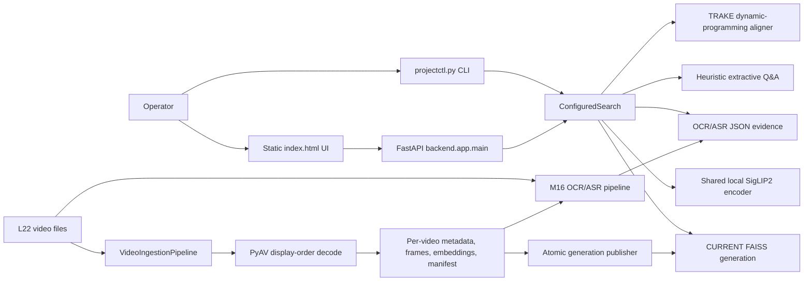

# Final System Audit and As-Built Architecture

**Audit date:** 2026-08-14

**Audited corpus:** `L22_V001`, `L22_V002`, `L22_V003` only

**Primary claimed-state source:** “Final M31.1 Bug-Freeze Report & Image-to-Frame Search Validation”

**Audit rule:** every claim was treated as untrusted until confirmed in current source, artifacts, executed tests, or a smoke command.

## Executive verdict

**Do not freeze the project as a completed, deployment-ready system.**

It is appropriate to keep the frozen three-video GT unchanged and to stop retrieval-quality tuning until representative official data is available. It is not justified to freeze correctness and operational work. The audit found false test totals, a failed corpus manifest, Q&A evidence leakage between candidates, a frame-serving symlink escape, unsafe frontend event construction, weak multipart handling, false readiness, backend construction during ASR resume, stale architecture documentation, disconnected duplicate retrieval stacks, no authentication, no Docker implementation, and an exact claimed TRAKE smoke that currently returns no alignment.

The clear correctness/security defects listed in [Audit fixes](#audit-fixes) were repaired without changing retrieval weights, FAISS vectors, frozen GT, or competition scoring. After those fixes:

- full tests: **264 passed, 18 skipped, 0 failed**;
- active generation: **3,578 FAISS vectors, 3,578 mappings, 3,578 payloads**;
- all three per-video manifests: `embeddings_ready`, with no failure/error;
- exact image self-match and 50% center crop: frame 15000 at rank 1;
- strict-offline search, KIS, Q&A, and image search: operational;
- exact claimed TRAKE command: still returns `{}` in the CLI and `[]` through the API.

## Scope and method

The audit inspected the active CLI, FastAPI app, static frontend, ingestion and text pipelines, index publication, frame identity, Q&A implementation, artifacts, tests, requirements, and deployment files. It executed:

- artifact checksum/identity validation through `load_current_frame_index`;
- physical frame, manifest, embedding, OCR, and ASR counts;
- sentinel resume smokes that raise if visual/OCR/ASR model work is invoked;
- strict-offline CLI smokes with `HF_HUB_OFFLINE=1` and `TRANSFORMERS_OFFLINE=1`;
- TestClient API, CORS, multipart, size-limit, readiness, and frame-serving smokes;
- an actual browser UI upload and DOM inspection;
- focused regression tests, the reported marker selection, and the full suite;
- `git diff --check`, worktree inventory, source scans, and Docker-file discovery.

No frozen GT file was modified. No retrieval-quality tuning or competition evaluation was performed. No real corpus video beyond L22_V001–V003 was processed.

## Claim-by-claim disposition

| Area | Verdict | Independent evidence |
|---|---|---|
| 1. Image-to-frame search | **Confirmed, with test caveats** | Active `ConfiguredSearch` shares `SigLIP2Encoder` with text/ingestion. CLI, multipart API, and frontend work. Exact self-match scored `1.0000001192`; the 50% center crop scored `0.8007059097`; both returned V001 frame 15000 at rank 1. Several original `test_image_search.py` cases skipped against a nonexistent `three-video-final` fixture, and its “normalization” test did not call the encoder. Audit regressions now cover real endpoint parsing with a stub searcher; the real model was covered by smoke commands. |
| 2. Q&A generalization | **Overclaimed** | Literal one-off branches were removed, but `video_qa.py` still contains curated geographic, disease, airline, animal, color, honorific, and structural-head lexicons plus type-specific regexes. The alleged unseen tests repeat many values encoded in those lists. Abstention exists and is tested. A separate correctness bug copied one pooled answer/evidence set to every ranked row; this audit changed attribution to per-candidate local evidence. |
| 3. Frame serving | **Confirmed after audit fix** | All 3,578 current physical frame image names are nine-digit numeric ordinals. The route intentionally also accepts prefixed legacy names. Filename traversal was blocked, but a symlinked video directory escaped `media_root` and served an outside file; the route now verifies the resolved frame root remains under the resolved media root. |
| 4. Frame identity | **Confirmed for the active M15 path, qualified repository-wide** | Active decoding uses the PyAV display-order ordinal from `enumerate(container.decode(stream))`. Timestamps select samples and align ASR but do not create authoritative IDs. A source scan found no `timestamp * FPS` frame-ID calculation. Legacy `FrameData`/sampler modules remain with a different string-ID contract, and active temporal NMS/Q&A windows still assume fixed frame-count distances (`60`/`150`), which are not equal durations across 25/30 FPS videos. |
| 5. Resume | **Partly confirmed after audit fix** | Visual resume validates artifacts and now heals a valid failed checkpoint. Sentinel runs over V001–V003 returned all reuse flags true and zero stage timings without calling `encode_image`. OCR and ASR sentinel runs reused all artifacts without constructing backends after the audit fix. However OCR/ASR reuse is based only on JSON-file existence, with no source, backend, language, configuration, schema, or model fingerprint. SigLIP identity hard-codes revision as `default`, not the cached snapshot commit. |
| 6. Artifact integrity | **Generation confirmed; report counts partly false** | `CURRENT` resolves to `gen-3d51a16ea32b4953820583c3af181b31`; generation checksums, FAISS, mappings, payloads, and canonical IDs validate at 3,578 each; staging is empty. Before the fix, V001 was `failed` with `encode_image should NOT be called on resumed video!`; it is now healed. The report’s decoded counts for V002/V003 were wrong. |
| 7. Offline operation | **Confirmed for local inference paths, with a TRAKE result caveat** | Cached model verification passed. Search, KIS, Q&A, image self-match, crop search, API search, and browser upload ran with both offline environment flags, while `ConfiguredSearch` uses `local_files_only=True`. TRAKE also ran locally but the exact claimed top-3 query produced no result. |
| 8. Tests | **Claim false** | Before this audit, collection was 276 tests: 258 selected by the reported marker expression and 18 marked out—not 302+18 or 260. Six audit regressions raised the current totals to 282 collected and 264 selected. Current full result is 264 passed/18 skipped. `git diff --check` prints no error, but 172 of 190 worktree entries are untracked, so that command does not examine most of the implementation. |
| 9. Security | **Improved, not complete** | CORS defaults are explicit localhost origins and wildcard-with-credentials is now rejected. Uploads are streamed to 15 MiB, robustly MIME-parsed, format-validated, and closed. Symlink traversal and inline-handler XSS were fixed. There is still no authentication or authorization, despite README wording that calls the frame endpoint authenticated; there is no CSP/security-header policy, and generic `/api/search` still exposes a server-local `image_path` mode. |
| 10. Docker/deployment | **Not implemented** | No `Dockerfile`, Compose file, or `.dockerignore` exists. README explicitly defers CUDA Docker packaging. There is no reverse-proxy, TLS, auth, or container health configuration. The CPU requirements path also omits Torch/Transformers/Hugging Face packages that are present in `pyproject.toml`. |

## As-built active architecture



### Runtime entry points

- **CLI:** `projectctl.py` is the operator entry point.
  - `search`/`kis` call `ConfiguredSearch.search`.
  - `qa` calls `ConfiguredSearch.handle(query_type="qa")`.
  - `image-search` calls `ConfiguredSearch.search_image`.
  - `trake` builds per-event candidates itself and emits a single dict or `{}`; the API goes through `ConfiguredSearch.handle` and returns a result list. Both currently produce no alignment for the claimed top-3 smoke.
- **API:** `backend/app/main.py:create_app` is the only mounted FastAPI application found.
- **Frontend:** `frontend/src/index.html` is a server-rendered static asset with vanilla JavaScript, not the React/Vite frontend described by the old `ARCHITECTURE.md`.

### Ingestion and authoritative frame identity

1. `projectctl preprocess/ingest` creates `VideoIngestConfig` and a local-only SigLIP2 encoder.
2. `VideoIngestionPipeline` hashes the source and derives a dependency-aware resume plan.
3. `video_decoder.iter_frames` enumerates decoded PyAV frames. That enumeration index is `source_frame_index_zero_based`.
4. `frame_sampler.iter_sample_frames` chooses the observed frame nearest each target timestamp, preserving its decoded ordinal.
5. `FrameRecord` derives `frame_uid` as `video_id:ordinal-padded-to-9`; submission ID is the configured zero/one-based transform of the ordinal.
6. Images use the decoded ordinal as a nine-digit filename such as `000015000.jpg`.
7. SigLIP2 image embeddings are normalized float32 arrays and stored per video.

The active pipeline does not infer frame identity from time or average FPS. Timestamps remain authoritative for temporal sampling and ASR alignment. The older `backend/app/samplers`, `schemas/FrameData`, and `loaders/metadata_loader` form an inactive, incompatible contract and should not be described as the active source of truth.

### Artifact contract and publication

Per video:

```text
<processed_root>/<video_id>/
  metadata.json
  frames.json
  frames/<nine-digit-source-ordinal>.jpg
  embeddings.npy
  manifest.json
  ocr.json
  asr.json
```

Corpus index:

```text
<processed_root>/index/
  CURRENT
  .staging/
  generations/<generation_id>/
    frames.faiss
    mapping.json
    payloads.json
    generation.json
```

Publication writes and validates a staging generation, atomically moves it into `generations`, then atomically publishes `CURRENT`. `generation.json` contains SHA-256 digests for the FAISS, mapping, and payload artifacts. The resolver verifies canonical ID agreement across all three artifacts.

### Active search behavior

- **Text/KIS:** encode text with the shared SigLIP2 encoder, search FAISS, expand candidates from lexical OCR/ASR hits, normalize visual scores, apply configured modality weights, sort deterministically, then apply temporal NMS.
- **Image:** encode the uploaded/PIL/path image with the same SigLIP2 vision tower used for corpus embeddings; search visual FAISS only; OCR and ASR scores are zero.
- **Q&A:** decompose the question for localization, reuse text/KIS ranking, collect OCR/ASR within the candidate’s local frame window, run the heuristic extractive answerer, and abstain with an empty answer if no candidate crosses the confidence threshold.
- **TRAKE:** retrieve each event independently and use dynamic programming to require one video and strictly increasing frame IDs.

The fixed `60`-frame NMS and `150`-frame Q&A radius encode a 30-FPS time assumption in comments/behavior. They do not corrupt frame identity, but durations differ for V001 (30 FPS) and V002/V003 (25 FPS). This audit did not change them because doing so would alter retrieval quality.

### Duplicate and inactive stacks

The repository contains several unmounted or milestone-era stacks:

- `backend/app/api/search_api.py` and `advanced_search_api.py` expose plain functions, not mounted routers;
- `SearchService` + `SigLIPFaissRetriever` is separate from active `ConfiguredSearch`;
- M12/M13/M14, hybrid, distributed, async, batch, sharded, and reranking pipelines coexist;
- old `FrameData` samplers conflict with active `FrameRecord` semantics;
- `ARCHITECTURE.md` describes React/Vite and a directory layout that is not the active application.

This duplication is not an immediate runtime failure because `backend.app.main` does not mount it, but it makes API ownership and contracts ambiguous and is a freeze/readiness risk. It was not refactored because the audit was explicitly limited to clear correctness fixes.

## Artifact audit

Post-fix state of `data/processed-validation/full-3-videos`:

| Video | Decoded frames | Sampled/physical records | Embedding shape | OCR | ASR | Manifest |
|---|---:|---:|---:|---:|---:|---|
| L22_V001 | 34,901 | 1,164 | `(1164, 768)` | 967 | 487 | `embeddings_ready` |
| L22_V002 | 29,681 | 1,188 | `(1188, 768)` | 960 | 347 | `embeddings_ready` |
| L22_V003 | 30,626 | 1,226 | `(1226, 768)` | 998 | 288 | `embeddings_ready` |
| **Total** | **95,208** | **3,578** | **`(3578, 768)` aggregate** | **2,925** | **1,122** | clean |

The handoff’s V002/V003 decoded counts (35,662 and 36,808) and total (107,371) do not match `metadata.json`, `manifest.json`, or the video reports in the audited root.

Generation result:

- `CURRENT`: `gen-3d51a16ea32b4953820583c3af181b31`;
- generation metadata count: 3,578;
- FAISS `ntotal`: 3,578;
- mapping entries: 3,578;
- payload entries: 3,578;
- all artifact SHA-256 checks: valid;
- canonical mapping/payload identities: valid;
- physical images: 3,578, all numeric image stems;
- `.staging`: empty.

## Resume audit

### Visual

The visual resume plan validates metadata, frame records and files, policy-derived submission IDs, embedding shape/dtype/finiteness/norms, fingerprints, and encoder identity. A sentinel encoder with the same recorded identity raised if called; all three audited videos returned:

```text
status=resumed
start_stage=complete
reused_metadata=True
reused_frames=True
reused_embeddings=True
metadata_ms=extraction_ms=embedding_ms=0
```

Before the audit fix, V001’s valid artifacts coexisted with a failed manifest left by an earlier sentinel attempt. A successful `complete` resume returned before clearing the failure. It now atomically heals the manifest, and failed/error manifests are excluded from new index selection.

### OCR/ASR

Current JSON artifacts were reused for all three videos with sentinel constructors that fail if Tesseract/EasyOCR or Faster Whisper is constructed. This required an audit fix in `projectctl._text_pipeline`, because the previous implementation constructed Faster Whisper before `M16TextPipeline` could discover the existing `asr.json`.

Remaining integrity limitation: M16 considers an artifact reusable solely because the requested JSON path exists. It does not validate JSON schema until load, source hash/mtime, selected frames, backend identity/version, OCR language set, ASR model/revision/compute type, or deduplication parameters. Therefore the handoff claim that fingerprints protect changed OCR/ASR configuration or model revisions is false.

## Search and offline smoke evidence

All commands below used the audited root and strict Hugging Face/Transformers offline flags.

| Operation | Result |
|---|---|
| `search "khởi công đền thờ" --top-k 3` | exit 0; V001 frame 450 ranked first; finite result fields |
| `kis "cháy rừng" --top-k 3` | exit 0; V002 frame 14350 ranked first |
| `qa "Nhiệt độ đạt bao nhiêu độ C?" --top-k 3` | exit 0; V001 frame 750, answer `40 ĐỘ C`, confidence 0.765, local evidence |
| `trake "cháy rừng \| lực lượng cứu hỏa" --top-k 3` | exit 0 but returned `{}`; API returned `[]` |
| exact frame 15000 image | rank 1 self-match, score `1.0000001192` |
| center 50% crop | rank 1 frame 15000, score `0.8007059097` |

Model cache verification reported both SigLIP2 and Faster Whisper ready locally. Search-side model construction explicitly uses local-only loading. The API and browser reuse the same active service.

## API, frontend, and security audit

Post-fix API smoke:

- `/health/live`: 200;
- `/health/ready`: 200 for the audited valid generation, 503 for a configured root without `CURRENT`;
- `/api/search`: KIS and Q&A 200; TRAKE 200 with zero results for the claimed query;
- `/api/search/image`: valid multipart 200, empty/corrupt 400, unsupported content type 415, over 15 MiB 413;
- numeric frame: 200 with `Cache-Control: public, max-age=86400`;
- allowed localhost CORS preflight: origin returned;
- unlisted-origin preflight: rejected without allow-origin;
- symlink escape regression: 404.

The browser smoke switched to Image Search, selected a real V001 frame, submitted multipart data, rendered 100 cards, and showed V001 frame 15000 first. Result cards were created with DOM APIs and text nodes. The first Copy button had no inline `onclick` attribute. The browser harness did not expose the resulting clipboard content, although no console error was recorded; clipboard formatting remains unit/source-reviewed rather than independently browser-asserted.

Remaining security/deployment gaps:

1. No route authenticates or authorizes callers. The README’s “Authenticated frame server” description is incorrect.
2. The default bind is localhost, but `--host` can expose the unauthenticated service.
3. `/api/search` still permits `query_type="image"` with a server-local path; remote clients should use upload-only image search.
4. No Content-Security-Policy or other explicit browser security headers are configured.
5. No reverse-proxy trust, TLS, rate limiting, audit logging, or production secret policy is implemented.

## Test audit

### Claimed versus actual

The handoff claimed 302 passed + 18 skipped and 260 deterministic passed. Before audit tests were added, independent collection showed:

- total collected: **276**;
- selected by `not real_model and not network and not gpu`: **258**;
- excluded by that expression: **18**.

The claimed totals were therefore overstated by 44 full-suite passes and 2 marker-selected passes.

This audit added six regression tests. Current executed results:

```text
pytest -o addopts='' -q -m "not real_model and not network and not gpu"
264 passed, 18 deselected, 1 warning in 107.26s

pytest -o addopts='' -q
264 passed, 18 skipped, 1 warning in 135.42s
```

The marker expression is mislabeled “deterministic” because it does not exclude the registered `slow` marker; it took 107 seconds. A separate `not slow and not real_model and not network and not gpu` run also exited 0 during the audit.

The only warning is a Starlette/FastAPI TestClient deprecation warning about its `httpx` compatibility layer.

`git diff --check` produces no output. That is not a clean-tree or freeze gate here: the worktree currently has **190** porcelain entries, including **172 untracked entries**, and `git diff --check` does not inspect untracked source files. A direct whitespace scan of audit-modified source/test files was clean.

## Audit fixes

Only clear correctness/security defects were changed:

1. **Q&A evidence attribution:** replaced corpus-wide pooled evidence/answer reuse with per-candidate, per-video local evidence extraction.
2. **Frame traversal:** rejected a resolved video/frame root outside `media_root`, including symlink escapes.
3. **Image upload:** streamed the request to a 15 MiB limit; parsed multipart with the standard MIME parser; required JPEG/PNG/WebP MIME and decoded format; returned safe errors; closed images; aligned frontend `top_k` with the query-string API contract.
4. **Frontend injection:** replaced `innerHTML` and inline JavaScript with `createElement`, `textContent`, property assignment, and event listeners.
5. **CORS:** filtered empty origins and rejected wildcard origins while credentials are enabled.
6. **Readiness:** validated `CURRENT`, the generation, and local model presence instead of treating any configured path as ready.
7. **Visual resume:** healed failure fields when a complete valid checkpoint resumes; excluded failed/error manifests from corpus publication selection.
8. **Text resume/offline:** avoided OCR/ASR backend construction when all selected artifacts already exist; new Faster Whisper construction is local-only.

### Audit-modified files

- `backend/app/main.py`
- `backend/app/services/configured_search.py`
- `backend/app/video/m15_ingestion_pipeline.py`
- `backend/app/video/ingest.py`
- `projectctl.py`
- `frontend/src/index.html`
- `tests/integration/test_configured_search.py`
- `tests/integration/test_m15_interrupted_resume.py`
- `tests/integration/test_m23_operator_api.py`
- `tests/unit/test_image_search.py`
- `tests/unit/test_projectctl.py`
- `tests/unit/test_qa_generalized_validation.py`
- `data/processed-validation/full-3-videos/L22_V001/manifest.json` (healed by the verified resume)
- `docs/final_system_audit_and_architecture.md`

## Retrieval benchmark impact

No retrieval ranking, fusion weight, FAISS vector, temporal threshold, query expansion, or GT changed. Candidate order and scores are unchanged by the audit. The Q&A fix changes only which answer/evidence is attached to each already-ranked candidate; it can reduce false cross-candidate attribution. Consequently no retrieval-quality benchmark was rerun, and the expected KIS/image/TRAKE ranking impact is **none**. The exact offline smokes reproduced the same KIS and image top hits; TRAKE remained empty at top 3.

## Freeze gates and recommendation

Maintain these freezes now:

- do not modify the three-video GT;
- do not tune retrieval quality against this development set;
- do not claim representative competition quality from three videos.

Do not declare the complete project frozen until at least:

1. the expected TRAKE behavior is specified and the failed claimed smoke is reconciled without GT overfitting;
2. OCR/ASR artifacts gain dependency-aware fingerprints and corrupt/stale-cache validation;
3. SigLIP encoder identity records an immutable model revision/snapshot;
4. the active `ConfiguredSearch`/FastAPI/FrameRecord architecture is declared authoritative and inactive duplicate stacks are deprecated or isolated with approval;
5. API authentication expectations are implemented or all documentation/deployment is explicitly constrained to trusted localhost use;
6. deployment is made reproducible (resolved CPU/GPU dependencies, pinned versions/lock, and tested container/process configuration if Docker is required);
7. production image/API/frontend tests no longer rely primarily on skipped or stubbed paths;
8. the worktree is brought under version control and freeze checks operate on tracked content.

**Final recommendation:** freeze GT and quality tuning, but keep the engineering stabilization track open. The system is usable as a local three-video development prototype after the audit fixes; it is not yet justified to label it bug-frozen, security-complete, or deployment-ready.
